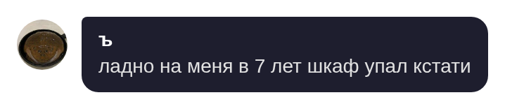
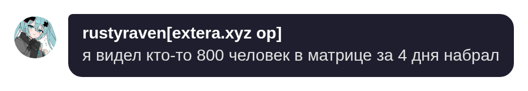

# QuoteD
**Quoted** is a Matrix bot that creates stickers from messages.

## Examples



## Setting up
1. **Clone the repo**
   ```
   git clone https://github.com/ryotairi/quoted.git
   ```
2. **Build docker image**
   ```
   cd quoted && docker build -t quoted .
   ```
3. Copy `config.example.yml` into `config.yml` and set homeserver URL, user ID and access token.
4. Start: `docker run -d --name quoted -v ./config.yml:/app/config.yml quoted`

## Usage
Reply to any message with **..q**, the bot will send a sticker and add it to room emote pack called "quoted".

You also can quote multiple messages. Reply with **.q 1** to quote that message and 1 next, etc...

Use **..q -c** to disable rendering of replied-to messages in the sticker.
