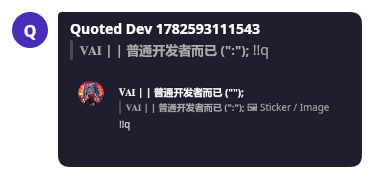
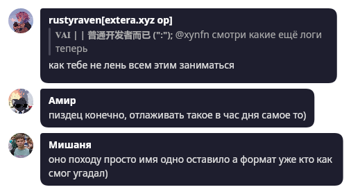
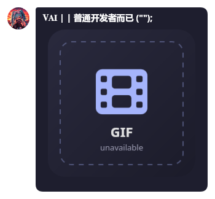

# QuoteD Matrix

**Quoted** is a Matrix bot that turns messages into beautiful stickers — with sticker / custom-emoji rendering, file-attachment cards, full Unicode fonts, and animated-sticker output.

Originally by [rustyraven](https://github.com/ryotairi/quoted), enhanced by [Vadim-Khristenko](https://github.com/Vadim-Khristenko/quoted-matrix).

## Features
- Quote one or many Matrix messages into a single sticker image
- **Configurable command prefix** – `commandPrefix: ".."` in `config.yml` (commands become `<prefix>q` / `<prefix>help`)
- **Stickers & images** – static WebP/PNG/GIF and **animated** output (animated WebP via ffmpeg)
  - Loads the original media (not server thumbnails) so **transparency is preserved** — no black backgrounds
  - Frame extraction uses sharp for GIF/WebP (keeps alpha), ffmpeg for video
- **Custom emoji** – inline `` rendered at `render.emojiSize`
  - If the emoji media is gone (server retention), falls back to the Unicode emoji from `alt` via Noto Color Emoji
- **GIFs & video** – Matrix sends GIFs as `m.video`; they're rendered animated, with a poster frame extracted via ffmpeg
  - When media can't be fetched or generated, a clean **GIF / VIDEO / STICKER placeholder card** is substituted instead of a blank space
- **Selectable animated output** – `render.animatedFormat: webp | gif | mp4` — pick what your bridge/clients support:
  - `webp` → native animated `m.sticker` (best quality, keeps alpha; some bridges can't show it)
  - `gif` → animated `m.image` (wide support, keeps transparency)
  - `mp4` → `m.video` (universal, but flattens transparency)
- **File / document attachments** – clean cards with **Font Awesome 6** vector icons, name, size, mime
- **Transparent background** – `render.transparentBackground: true` for Telegram-style stickers with alpha
- **Full Unicode coverage** – Noto Sans / Math / Symbols2 / Color Emoji / CJK + Font Awesome 6
  - Renders 𝐕𝐀𝐈, 𝕋𝔼𝕊𝕋, 😀🎉, 你好, etc. correctly
- **Authenticated media** – uses the modern `/_matrix/client/v1/media/*` endpoints with `Authorization: Bearer` (legacy `/media/v3/` is rejected by current servers)
- **Profile caching** – avatars and display names are cached per render batch (one fetch per user)
- **Designed logger** – aligned, colorized, scoped, with white-on-colour level badges and `(STATUS CODE: …)` tags; `logLevel: debug|info|warn|error`
- Runs on **Bun**

## Examples

All rendered from live Matrix messages (real users, avatars, and stickers):

| Text quote | Sticker with reply | Conversation | Missing media |
|---|---|---|---|
|  |  |  |  |

Animated quote output – a Matrix `m.video` re-encoded into the configured format. GIF keeps transparency and animates inline here:


Same quote in the other output formats: [animated WebP](examples/03-animated-webp.webp) (native sticker, smaller) · [MP4](examples/03-animated-mp4.mp4) (universal, no transparency).

Regenerate all of these against your own homeserver with `bun run test/examples.ts`.

## How quotes are delivered

The bot first replies with a "⏳ Generating quote…" message, then:

- **Static quote** → that message is removed and a native **`m.sticker`** is sent (and added to the room's `im.ponies` pack).
- **Animated quote** → the message is **edited in place** into the result: `mp4` → `m.video`, `gif`/`webp` → `m.image` (both animate in clients).

If a quoted attachment can't be fetched (e.g. server retention deleted it), the quote still renders with a clear **placeholder card** instead of failing.

## Setting up (Bun)

```bash
git clone https://github.com/Vadim-Khristenko/quoted-matrix.git
cd quoted-matrix
bun install
cp config.example.yml config.yml   # edit homeserverUrl, userId, accessToken
bun run src/index.ts                # or: bun run --hot src/index.ts
```

### Docker

```bash
docker build -t quoted .
docker run -d --name quoted -v ./config.yml:/app/config.yml quoted
```

Image includes: Bun, Noto fonts (Sans / Math / Symbols2 / Mono / CJK / Color Emoji), Font Awesome 6, ffmpeg, sharp, ca-certificates.

## Usage

Reply to any message with **..q** — the bot sends a sticker and adds it to the room's "quoted" emote pack.

- **..q 1** – quote that message plus 1 following message (max 10)
- **..q -c** – don't render the replied-to message inside the sticker

Prefix and command names are configurable:
```yaml
commandPrefix: ".."
commands:
  quote: "q"
  help: "help"
```

Supported message types: `m.text` (rich HTML + emoji), `m.image` / `m.sticker` (static & animated), `m.file` / `m.audio` / `m.video` (attachment card), and custom emoji via ``.

## Configuration (`render`)

```yaml
render:
  animatedStickers: true            # render animated quotes (needs ffmpeg)
  animatedFormat: webp              # webp | gif | mp4  – animated output format
  transparentBackground: true       # alpha background
  transparentBubbles: false
  stickerMaxSize: 512
  emojiSize: 22
  maxFrames: 60
  fps: 20
  ffmpegPath: "ffmpeg"              # or full path, use forward slashes on Windows:
                                    # "D:/ffmpeg/bin/ffmpeg.exe"
```

> On Windows, write `ffmpegPath` with **forward slashes** or single quotes — double-quoted YAML interprets `\b`, `\f`, `\t` as escape codes and corrupts the path.

## Logging

Every line follows a single format:

```
{TIME} |{module}> [{LEVEL}] (STATUS CODE: {code}) | {message} <|
```

- **Levels:** `DEBUG`, `INFO`, `SUCCESS`, `WARN`, `ERR`, `FAIL` — each a white badge on a coloured background.
- `FAIL` marks genuine data failures (media couldn't be fetched, generation fell back, a quote couldn't be built).
- The `(STATUS CODE: …)` tag appears only when a log carries an HTTP status.
- `matrix-js-sdk`'s own output (HTTP, sync, push rules) is routed through the same format under the `sdk` module; its verbose stream shows only at `logLevel: debug`.

```
11:08:12.970 |matrix > [SUCCESS] | client ready for @bot @ https://extera.xyz <|
11:08:12.984 |render > [ WARN  ] (STATUS CODE: 404) | media emoji extera.xyz/abc <|
11:08:12.984 |render > [ FAIL  ] | gif media unavailable, substituting placeholder <|
```

Set verbosity with `logLevel: debug|info|warn|error`. Colour is disabled automatically when `NO_COLOR` is set.

## Testing

```bash
bun run test            # renders sample images into tmp/
bun run test/examples.ts # regenerate README examples from your live homeserver
bun run test/diag.ts    # probe your homeserver's media endpoints (useful for debugging)
```

## Font troubleshooting

If you see tofu □ instead of glyphs/emoji, ensure `fonts/` contains the Noto fonts and `fa-solid-900.ttf`. In Docker these are installed automatically (`fonts-noto-core`, `fonts-noto-color-emoji`, `fonts-noto-cjk`).

Fallback chain: `Noto Sans → Noto Sans Math → Noto Sans Symbols2 → Noto Color Emoji → Noto Sans CJK → sans-serif`.

## License
AGPL-3.0-only
