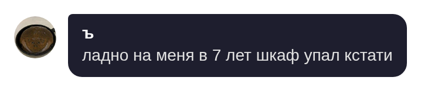
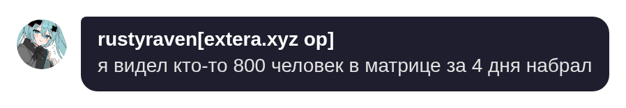

# QuoteD Matrix

**Quoted** is a Matrix bot that turns messages into beautiful stickers — with sticker / custom-emoji rendering, file-attachment cards, full Unicode fonts, and animated-sticker output.

Originally by [rustyraven](https://github.com/ryotairi/quoted), enhanced by [Vadim-Khristenko](https://github.com/Vadim-Khristenko/quoted-matrix).

## Features
- Quote one or many Matrix messages into a single sticker image
- **Configurable command prefix** – `commandPrefix: ".."` in `config.yml` (commands become `<prefix>q` / `<prefix>help`)
- **Stickers & images** – static WebP/PNG/GIF and **animated** output (animated WebP via ffmpeg)
  - Loads the original media (not server thumbnails) so **transparency is preserved** — no black backgrounds
  - Frame extraction uses sharp for GIF/WebP (keeps alpha), ffmpeg for video
- **Custom emoji** – inline `` rendered at `render.emojiSize`
  - If the emoji media is gone (server retention), falls back to the Unicode emoji from `alt` via Noto Color Emoji
- **File / document attachments** – clean cards with **Font Awesome 6** vector icons, name, size, mime
- **Transparent background** – `render.transparentBackground: true` for Telegram-style stickers with alpha
- **Full Unicode coverage** – Noto Sans / Math / Symbols2 / Color Emoji / CJK + Font Awesome 6
  - Renders 𝐕𝐀𝐈, 𝕋𝔼𝕊𝕋, 😀🎉, 你好, etc. correctly
- **Authenticated media** – uses the modern `/_matrix/client/v1/media/*` endpoints with `Authorization: Bearer`
- **Structured logging** – colorized, timestamped, scoped (`[quoted][render] INFO …`), `logLevel: debug|info|warn|error`
- Runs on **Bun**

## Examples



## Setting up (Bun)

```bash
git clone https://github.com/Vadim-Khristenko/quoted-matrix.git
cd quoted-matrix
bun install
cp config.example.yml config.yml   # edit homeserverUrl, userId, accessToken
bun run src/index.ts                # or: bun run --hot src/index.ts
```

### Docker

```bash
docker build -t quoted .
docker run -d --name quoted -v ./config.yml:/app/config.yml quoted
```

Image includes: Bun, Noto fonts (Sans / Math / Symbols2 / Mono / CJK / Color Emoji), Font Awesome 6, ffmpeg, sharp, ca-certificates.

## Usage

Reply to any message with **..q** — the bot sends a sticker and adds it to the room's "quoted" emote pack.

- **..q 1** – quote that message plus 1 following message (max 10)
- **..q -c** – don't render the replied-to message inside the sticker

Prefix and command names are configurable:
```yaml
commandPrefix: ".."
commands:
  quote: "q"
  help: "help"
```

Supported message types: `m.text` (rich HTML + emoji), `m.image` / `m.sticker` (static & animated), `m.file` / `m.audio` / `m.video` (attachment card), and custom emoji via ``.

## Configuration (`render`)

```yaml
render:
  animatedStickers: true            # animated WebP output (needs ffmpeg)
  transparentBackground: true       # alpha background
  transparentBubbles: false
  stickerMaxSize: 512
  emojiSize: 22
  maxFrames: 60
  fps: 20
  ffmpegPath: "ffmpeg"              # or full path, use forward slashes on Windows:
                                    # "D:/ffmpeg/bin/ffmpeg.exe"
```

> On Windows, write `ffmpegPath` with **forward slashes** or single quotes — double-quoted YAML interprets `\b`, `\f`, `\t` as escape codes and corrupts the path.

## Testing

```bash
bun run test          # renders sample images into tmp/
bun run test/diag.ts  # probes your homeserver's media endpoints (useful for debugging)
```

## Font troubleshooting

If you see tofu □ instead of glyphs/emoji, ensure `fonts/` contains the Noto fonts and `fa-solid-900.ttf`. In Docker these are installed automatically (`fonts-noto-core`, `fonts-noto-color-emoji`, `fonts-noto-cjk`).

Fallback chain: `Noto Sans → Noto Sans Math → Noto Sans Symbols2 → Noto Color Emoji → Noto Sans CJK → sans-serif`.

## License
AGPL-3.0-only
